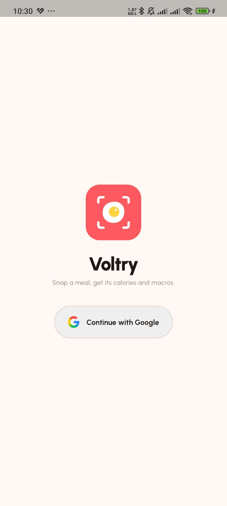
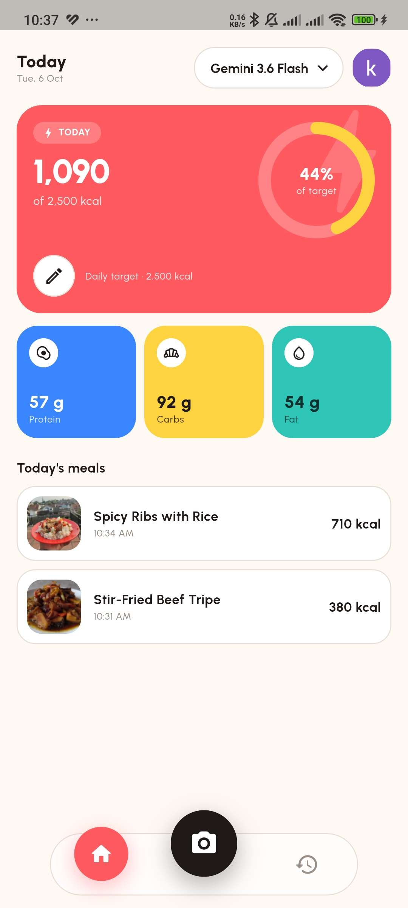
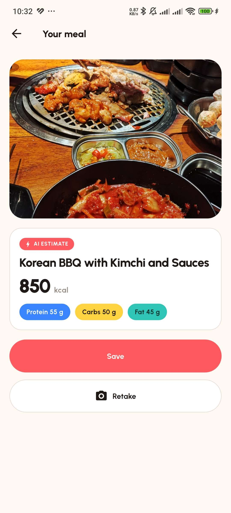
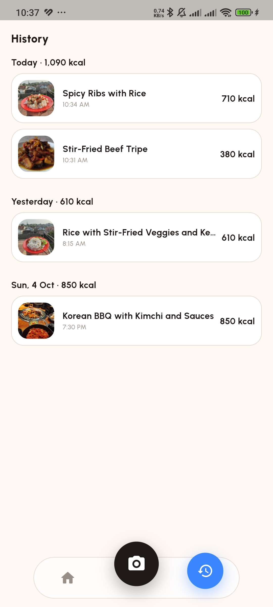

<div align="center">

# Voltry

**Snap a meal, get its calories and macros.**


</div>

Voltry is a Flutter app for iOS and Android that estimates the nutrition of a meal from a photo. Gemini, called through Firebase AI Logic, returns the meal name, calories, protein, carbs and fat for the whole plate as schema-constrained JSON, and the app validates that answer before showing it. You sign in with Google, and the meals you save and your daily calorie target are stored in your account on Cloud Firestore, so they come back after a reinstall or on another phone. Firestore's offline cache keeps the history readable without a connection and queues changes until it returns. Meal photos stay on the phone that took them.

---

## Contents

- [Screenshots](#screenshots)
- [Features](#features)
- [Tech Stack](#tech-stack)
- [Architecture](#architecture)
- [Project Structure](#project-structure)
- [Getting Started](#getting-started)
- [Data & Storage](#data--storage)
- [AI & Security](#ai--security)
- [Build & Distribution](#build--distribution)
- [Testing](#testing)
- [License](#license)

---

## Screenshots

The sign-in screen and the three main screens:

| Sign in | Home | Analyze | History |
| :---: | :---: | :---: | :---: |
|  |  |  |  |
| The app icon and one Google-style button: Continue with Google | Today's calories against the target, macro tiles, today's meals, the active AI model, and the account avatar | The AI estimate for one photo, with Save and Retake | Meals grouped by day with daily totals, swipe to delete |

---

## Features

| Area | Capabilities |
| --- | --- |
| **Sign in** | Continue with Google on first launch. The session survives restarts, and the avatar in the Home header opens the account with **Sign out** |
| **Sync** | Meals and the daily target are stored per account in Cloud Firestore. Reinstall the app or sign in on another phone and they come back. The history stays readable offline, Save and Delete queue until the connection returns, and coming back to the app picks up meals saved elsewhere |
| **Photo analysis** | Take a photo or pick one from the gallery with the camera button in the middle of the navbar. Gemini estimates the meal name, calories, protein, carbs and fat for everything on the plate |
| **Validated AI output** | The answer is schema-constrained JSON, then checked for type and range before anything reaches the UI. Photos without food get a *No food found* state instead of made-up numbers |
| **Explicit save** | Nothing is stored until you tap **Save**, so a bad estimate can be discarded or retaken |
| **Today** | Today's calories with a ring showing the percentage of your target (and *kcal over* past 100%), protein / carbs / fat tiles, and today's meals |
| **Calorie target** | Edit the daily target from the Home card. Whole numbers from 800 to 5,000 kcal, saved to your account |
| **History** | Meals grouped by day with daily totals (*Today*, *Yesterday*, *Sat, 28 Sep*). Swipe to delete, with Undo |
| **Meal detail** | Photo, date and time, the nutrition card, and delete with confirmation |
| **AI model picker** | Switch between four Gemini models from the Home header. Each free-tier model has its own quota, and when one runs out the Analyze screen offers **Switch AI model** and re-runs the same photo |
| **Error handling** | Offline and timeouts, a failed Google sign-in, a used-up AI quota, denied camera or photo access, and storage errors each get a specific message and a way forward |
| **Day rollover** | *Today* moves forward at local midnight and whenever the app returns to the foreground, so opening it in the morning never shows yesterday's totals |
| **Design system** | Candy Sport: color, type and radius tokens in a `ThemeExtension`, the Urbanist font, and a floating blurred navbar. Widgets take every visual value from the theme |

---

## Tech Stack

| Need | Package |
| --- | --- |
| State management | `flutter_riverpod` (Riverpod 3) |
| Navigation | `go_router`, with a sign-in redirect and a `StatefulShellRoute` for the two tabs |
| Sign in | `firebase_auth`, `google_sign_in` 7 |
| Cloud database | `cloud_firestore`, with its offline cache |
| AI | `firebase_ai` (Firebase AI Logic, Gemini Developer API), `firebase_core` |
| Camera and gallery | `image_picker` |
| Files | `path_provider`, `path` |
| Settings | `shared_preferences` |
| IDs and formatting | `uuid`, `intl` |
| Loading animation | `lottie` |
| App icon | `flutter_launcher_icons` (dev) |
| Testing | `flutter_test`, `fake_cloud_firestore` (dev) |

**No code generation.** Models, their `fromRow` / `toRow` mapping, and every Riverpod provider are written by hand. There is no `freezed`, `json_serializable`, `riverpod_generator` or `build_runner`, so every file reads as it runs. The Urbanist font ships as an asset instead of coming from `google_fonts`.

---

## Architecture

Each feature is split into three layers, and dependencies only point one way:

```text
Widget → Controller (Riverpod Notifier) → Repository / Analyzer → Firestore · Firebase Auth · files · shared_preferences · Gemini
```

```text
features/<feature>/
├── domain/              Hand-written models, sealed result types, pure business rules
├── data/                Repositories, the Gemini analyzer and its parser, sign-in, photo picking and storage
└── presentation/
    ├── controllers/     Riverpod Notifier / AsyncNotifier, the glue between data and UI
    ├── states/          Sealed state classes for screens with several states
    ├── pages/           Full screens
    └── widgets/         Widgets local to the feature
```

### Layer rules

| Layer | May use | Must not use |
| --- | --- | --- |
| `domain` | Plain Dart, `flutter/foundation` | Widgets, Riverpod, Firebase |
| `data` | The one SDK it owns (see below), domain models, `AppException`, its own provider | Widgets, controllers, letting third-party exceptions escape |
| `presentation/controllers` | Repositories and the analyzer through `ref`, pure domain functions | Firestore, files, Firebase, widgets |
| `presentation/pages` + `widgets` | `ref.watch` on controllers, theme tokens | Data sources, business rules, hard-coded colors or font sizes |

### One owner per data source

Every external source is touched by exactly one class, and everything else reaches it through a provider so tests can swap in a fake:

| Source | Only class allowed to touch it |
| --- | --- |
| Cloud Firestore | `FirestoreMealLogRepository` (meals) and `CalorieTargetRepository` (daily target) |
| Firebase Auth, Google Sign-In | `AuthRepository` |
| Photo files | `PhotoStorage` |
| shared_preferences | `AiModelRepository` |
| firebase_ai | `GeminiFoodAnalyzer` |
| image_picker | `PhotoPicker` |

These classes also translate third-party exceptions (`SocketException`, `TimeoutException`, Firebase AI, Firestore, Firebase Auth and Google Sign-In errors, `FileSystemException`, `PlatformException`) into a sealed `AppException`. The UI only ever sees `AppException`. A photo without food is a `NotFood` result, and closing the Google account picker simply leaves you on Sign in: neither is an exception.

Business rules are pure functions with their own unit tests: `parseAnalysis` for the AI answer, `summarizeDay` and `groupByDay` for totals, `dayLabel`, target validation, `authError` and `firestoreError` for error mapping, `initialOf` for the avatar, and `errorMessage`. Controllers only connect them to the UI. Meals are read through a `MealLogRepository` interface: moving them from on-device SQLite to Firestore replaced that one implementation, and no screen or controller changed.

### Sign-in and per-user data

- The router redirects to `/sign-in` whenever nobody is signed in, and back to Home after Google sign-in. It listens to a copy of the auth state, so signing in or out re-runs the redirect without rebuilding the router.
- Repositories take the user ID from `currentUserProvider`, so each account reads and writes only `users/{its uid}`. That provider deliberately ignores sign-out and keeps the last account until a different one signs in: Home and History slide away to Sign in with their meals still on screen instead of rebuilding without a user. A widget test checks every frame of that transition.
- Firestore writes are not awaited until the server confirms them. Firestore applies them to its local cache at once and sends them when it can, so Save and Delete never freeze offline.

### Layers per feature

| Feature | `domain` | `data` | `presentation` |
| --- | :---: | :---: | --- |
| `auth` | ✓ | ✓ | controllers, pages, widgets |
| `analysis` | ✓ | ✓ | controllers, states, pages, widgets |
| `meal_log` | ✓ | ✓ | controllers, pages, widgets |
| `calorie_target` | ✓ | ✓ | controllers, widgets |

Deliberate exceptions, so they are not mistaken for drift:

- **[`snap_meal_flow.dart`](lib/features/analysis/presentation/snap_meal_flow.dart) sits at the root of `analysis/presentation/`.** It is a flow (photo source sheet → picker → Analyze → back to the sheet on Retake), not a page or a widget, and it is started from the navbar camera button in [`app_shell.dart`](lib/core/router/app_shell.dart) so both tabs share it.
- **Only `analysis` has `states/`.** The Analyze screen has four states (loading, result, not food, failure), modelled as a sealed `AnalyzeState`. The other controllers expose a plain `AsyncValue` or value.
- **`calorie_target` has no `pages/`.** Its only UI is a dialog opened from the Home card.

The rules above are also documented for contributors in [CLAUDE.md](CLAUDE.md).

---

## Project Structure

```text
lib/
├── core/
│   ├── errors/      sealed AppException, errorMessage(), firestoreError()
│   ├── formatting/  number and date formatting (formatNumber, dayLabel, …)
│   ├── providers/   shared_preferences, Firestore, clock, id generator, todayProvider
│   ├── router/      go_router routes, the sign-in redirect, and the two-tab shell
│   ├── theme/       Candy Sport tokens: VoltryColors, VoltryText, VoltryRadius
│   └── widgets/     design system: VoltryNavBar, HeroCard, CalorieRing, StatTile, …
├── features/
│   ├── auth/            Google sign-in, Sign in page, account avatar and sheet
│   ├── analysis/        photo → Gemini → validated result, AI model picker
│   ├── calorie_target/  daily calorie target
│   └── meal_log/        saved meals, Home, History, Meal detail
├── app.dart
└── main.dart
```

`test/` mirrors `lib/`, with hand-written fakes in `test/fakes/`. Firestore holds `users/{uid}` (the calorie target) and `users/{uid}/meals/{id}` (one document per meal), guarded by [firestore.rules](firestore.rules).

---

## Getting Started

### Prerequisites

- Flutter 3.44 with Dart `^3.12.2`
- Android Studio or Xcode for an emulator or simulator, or a real device to use the camera
- Targets: Android (Flutter's default `minSdk`) and iOS 15.0+
- A Firebase project with AI Logic, Authentication (Google) and Cloud Firestore. All three run on the free Spark plan

### Install and run

```bash
flutter pub get
flutter run
```

There is no code generation step. `flutter test` and `flutter analyze` work right after cloning, but running the app needs the Firebase setup below.

### Firebase setup

1. In the [Firebase console](https://console.firebase.google.com), create a project, then open **Build → AI Logic → Get started** and choose **Gemini Developer API**.
2. Open **Build → Authentication → Sign-in method** and enable **Google**.
3. Open **Build → Firestore Database → Create database**, then paste [firestore.rules](firestore.rules) into the **Rules** tab and publish.
4. Add your debug keystore's SHA-1 under **Project settings → Your apps**. On a new project, first register an Android app with the package name `com.example.voltry`; `flutterfire configure` in the next step reuses it:

   ```bash
   keytool -list -v -keystore ~/.android/debug.keystore -alias androiddebugkey -storepass android -keypass android
   ```

5. Connect the app:

   ```bash
   firebase login
   dart pub global activate flutterfire_cli
   flutterfire configure --project=<project-id> --platforms=android,ios
   ```

6. Copy `CLIENT_ID` and `REVERSED_CLIENT_ID` from `ios/Runner/GoogleService-Info.plist` into `ios/Runner/Info.plist`, as `GIDClientID` and as the URL scheme under `CFBundleURLTypes`.
7. Check that `git status` does not list the generated files. `android/app/google-services.json`, `ios/Runner/GoogleService-Info.plist`, `lib/firebase_options.dart` and `firebase.json` are all git-ignored.

`main.dart` calls `Firebase.initializeApp()` without options, so the app reads the two native config files and never imports `firebase_options.dart`. Without them the Android build fails and the iOS app crashes at launch. The full guide, including troubleshooting, is in [docs/setup/firebase.md](docs/setup/firebase.md) (Indonesian).

> **Use your own Firebase project.** The config files are kept out of this public repo because the app has no App Check: anyone holding them could spend the Gemini quota of the project they belong to. The Google client IDs in `Info.plist` are committed, since Google Sign-In on iOS requires them there, but they belong to the original project, so replace them with yours.

### Regenerating the app icon

Run after changing `assets/icon/voltry-app-icon.png`:

```bash
dart run flutter_launcher_icons
git checkout -- ios/Runner.xcodeproj/project.pbxproj
```

The second command undoes a side effect of `flutter_launcher_icons` 0.14.4, which rewrites every Xcode build setting containing `ASSETCATALOG`, including `ASSETCATALOG_COMPILER_GENERATE_SWIFT_ASSET_SYMBOL_EXTENSIONS`. The app icon name is already `AppIcon`, so reverting the project file loses nothing.

---

## Data & Storage

- **Source of truth.** Cloud Firestore, per account. `users/{uid}` holds the calorie target, and `users/{uid}/meals/{id}` holds one document per meal with the same snake_case fields as `MealLog.toRow()`.
- **Offline.** Firestore's local cache answers reads without a connection. Save, Delete and Undo apply to the cache at once and are sent when the connection returns. The app never waits for the server, so nothing freezes offline, and a write the server rejects is reported only in the debug console.
- **Back in the app.** Returning to the foreground fetches again in the background, so a meal saved on another phone appears without a spinner.
- **Explicit save.** An analysis is only stored when you tap **Save**. The meal's ID is a UUID generated on the device, and its time is the moment you saved it.
- **Timestamps.** `created_at` is stored as UTC epoch milliseconds, an integer rather than a Firestore `Timestamp` or an ISO string: the microsecond digits that `toIso8601String()` sometimes adds break string ordering. Grouping by day uses the local date.
- **Photos.** Saved photos are copied to `<documents>/meal_photos/<id>.<ext>` on the phone, and the meal document stores only the file name. The full path is built at runtime because the iOS documents path changes when the app is reinstalled or updated. A missing file shows a placeholder instead of crashing.
- **Settings.** The chosen AI model stays in `shared_preferences` on the device, because the free quotas belong to the Firebase project rather than the account. It is stored by its ID rather than its enum index, and an unknown ID falls back to Gemini 3.7 Flash.
- **Delete and Undo.** Swiping a meal in History removes it at once, but the photo file is only deleted after the Undo snackbar closes without Undo. Deleting from Meal detail asks for confirmation and removes both immediately.

> **Photos are the one thing a reinstall loses.** Meals, their numbers and times, and the daily target come back with the account. Syncing photos would need Cloud Storage for Firebase, which requires the pay-as-you-go Blaze plan, and Blaze also makes every Gemini request billable.

---

## AI & Security

The analysis pipeline, from photo to screen:

```text
Camera / gallery ─▶ PhotoPicker            image_picker, max 1024 px wide, quality 85
                 ─▶ GeminiFoodAnalyzer     prompt + photo, JSON response schema, 30 s timeout
                 ─▶ parseAnalysis()        types, ranges, and name checked
                 ─▶ FoodFound / NotFood ─▶ Analyze screen ─▶ Save
```

- **Structured output.** The request sets `responseMimeType: application/json` and a `responseSchema` with six required fields: `is_food`, `food_name`, `calories`, `protein_g`, `carbs_g` and `fat_g`. Temperature is left at the default, as Google recommends for the Gemini 3 family.
- **Never trusted raw.** [`parseAnalysis`](lib/features/analysis/data/analysis_parser.dart) is the only code that reads the AI's JSON. It requires a JSON object, returns `NotFood` when `is_food` is false, trims the name (empty is rejected, longer than 60 characters is cut), rounds numbers that arrive as doubles, and rejects calories outside 0–5,000 or a macro outside 0–1,000. Anything else becomes an `AiException`.
- **Model choice.** Four free-tier Gemini models that accept images and structured output are listed in [`AiModel`](lib/features/analysis/domain/ai_model.dart). Google retires models regularly, so the list should be checked against the [Firebase AI Logic model docs](https://firebase.google.com/docs/ai-logic/models) before it changes. In debug builds the analyzer prints the model name and the original error, so a rejected or rate-limited model is easy to spot.

What the user sees when something fails, from the pure [`errorMessage`](lib/core/errors/app_exception.dart) function:

| Condition | Message | Actions |
| --- | --- | --- |
| Offline or 30 s timeout | You're offline or the connection is slow. Check it and try again. | Try again, Retake |
| Google sign-in failed | Couldn't sign in with Google. Please try again. | Continue with Google |
| AI quota used up | This AI model has reached its free limit. Switch models or try again later. | **Switch AI model**, Try again, Retake |
| Invalid or failed AI response | Couldn't analyze this photo. Please try again. | Try again, Retake |
| Camera or photos access denied | Couldn't open the camera or photos. Check Voltry's access in Settings. | |
| Firestore, file or settings error | Couldn't access your data. Please try again. | Retry |
| Photo without food (not an error) | No food found in this photo. | Retake |

### Security notes

- **Firebase config is never committed**, as described in [Firebase setup](#firebase-setup).
- **Each account sees only its own data.** [firestore.rules](firestore.rules) lets a signed-in user read and write `users/{their uid}` and its meals, and denies everything else.
- **The Google client IDs in `Info.plist` are committed.** Google Sign-In on iOS requires them there. They are public identifiers that give no access to Gemini or Firestore.
- **No App Check and no per-user rate limiting.** Only the owner runs the app, so neither is in scope. Add App Check before handing builds to anyone else.
- **What leaves the device.** The photo goes to Gemini for analysis, and the meal entries and calorie target go to Firestore. Photos are never uploaded for storage.

---

## Build & Distribution

Voltry is a portfolio project. It is not published to the App Store or Google Play, and there are no public builds. To try it, build from source against your own Firebase project:

```bash
flutter run --release   # on a connected device
```

---

## Testing

```bash
flutter test              # unit & widget tests
flutter test --coverage   # writes coverage/lcov.info
flutter analyze           # lint
```

186 tests in 36 files run without a device, network, Firebase config or Google account. Firestore runs in memory through `fake_cloud_firestore`, sign-in goes through a hand-written `FakeAuthRepository`, `shared_preferences` uses mock initial values, files go to temporary directories, and every fake in `test/fakes/` is written by hand, with no mocking library:

| Scope | Covered |
| --- | --- |
| Pure functions | `parseAnalysis` (valid answer, not food, missing fields, negative or out-of-range numbers, doubles, broken JSON, empty or long names), daily totals, grouping by day, day labels, error messages, `authError`, `firestoreError`, `initialOf`, target validation, `AiModel.fromId` |
| Data | `FirestoreMealLogRepository` (newest first, the stored document, delete, restore with the same ID, one user never seeing another's meals, following the next account to sign in), `CalorieTargetRepository` (fallback, invalid values, merging into the user document), `PhotoStorage` (save, resolve, delete, missing file), the AI model repository (defaults, stored values, failed writes), and `GeminiFoodAnalyzer` exception mapping through an injected request function |
| Controllers | Auth state (restored session, the current user kept through sign-out), sign in (loading, cancel, failure), Analyze (loading → result / not food / failure, retry, save), meal logs (add, delete, restore, purge photo, reload on resume), calorie target, AI model selection |
| Widgets | Sign in (centered layout, the Google button's logo and width, progress, cancel, retrying while the error is showing), the account avatar and sheet (initial fallback, Cancel, signing out with no error frame on the way, switching accounts), Home (ring, over target, list, empty, failed target load, refresh on resume), Analyze (all four states, Switch AI model on quota), History, Meal detail, the target dialog, the AI model sheet, the full snap → analyze → save flow, the design system components and theme |

Real Google sign-in, real Firestore with its offline cache, Gemini calls and the camera are not automated. They are checked by hand on a device: sign in, save a meal, reinstall, sign in again, and use the app in airplane mode.

---

## License

Released under the [MIT License](LICENSE).

The Urbanist font in `assets/fonts/` is licensed separately under the SIL Open Font License ([OFL.txt](assets/fonts/OFL.txt)).

The Google "G" logo in `assets/images/` is a trademark of Google LLC. It is taken from Google's [sign-in branding kit](https://developers.google.com/identity/branding-guidelines) with its shape and colors unchanged, and is not covered by the MIT License.
